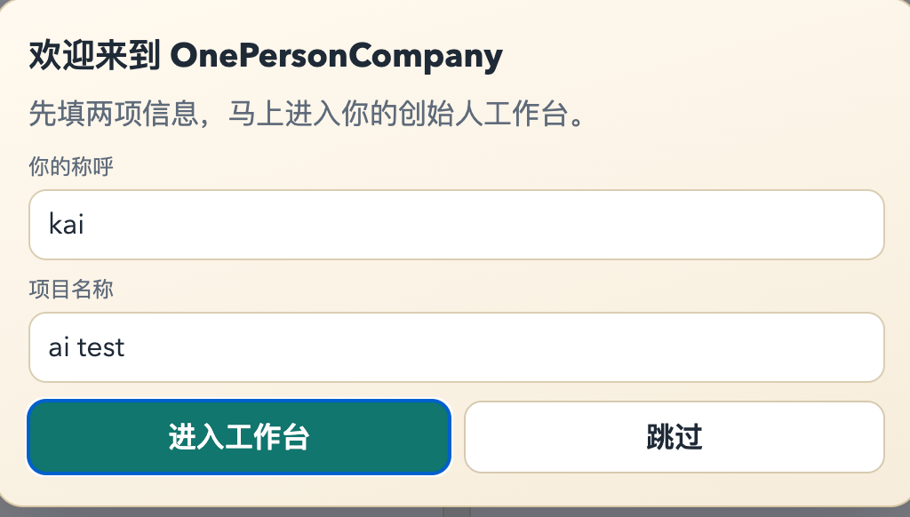
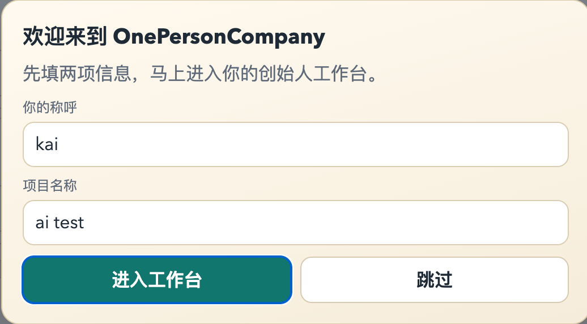

# OnePersonCompany

[](#quick-start)
[](#api)
[](#llm-setup)
[](./LICENSE)

**把一人创业的碎片工作，压成可执行、可发布、可分享的成果。**

OnePersonCompany 是一个面向独立开发者/小团队创始人的 Agent 产品：
输入几条日常进展，自动生成 `每日简报` / `发版包` / `周复盘` / `多平台分享素材`。

## Why It Matters

传统方式：
- 信息散在 IM、Issue、脑内记忆
- 每次发版都要重写说明和宣传文案
- 周复盘常常遗漏关键数据

OnePersonCompany：
- 30 秒看到结构化结果
- 一次输入，产出执行文档 + 社媒素材
- 支持导出结果卡片 PNG，直接传播

## 30-Second Demo

1. 启动服务

```bash
uvicorn onepersoncompany.api:app --reload --host 0.0.0.0 --port 8100
```

2. 打开页面

- 控制台：`http://localhost:8100/`
- 公开演示：`http://localhost:8100/demo`

3. 点击 `30 秒体验（免 Key）`

你会立刻看到：
- Before / After 价值对比
- 样例输出
- 可复制的多平台分享文案

## Screenshots





## Core Features

- 面向创始人的 3 个主流程：`每日简报`、`发版包`、`周复盘`
- 一键生成社媒素材：X / 朋友圈 / 小红书
- 公开演示页 `/demo`（只读，适合外链传播）
- 结果卡片主题切换 + PNG 导出
- LLM 多厂商支持（OpenAI / Anthropic / DeepSeek / DashScope / Moonshot / Zhipu）
- 请求日志与异常日志落盘（`logs/onepersoncompany.log`）

## Quick Start

```bash
git clone https://github.com/Kai-dev7/OnePersonCompany.git
cd OnePersonCompany
cp .env.example .env
# 编辑 .env，至少设置 1 个 provider 的 key
uvicorn onepersoncompany.api:app --reload --host 0.0.0.0 --port 8100
```

## LLM Setup

### Zhipu (recommended for CN users)

```env
OPC_LLM_PROVIDER=zhipu
OPC_LLM_MODEL=glm-4-flash
ZHIPU_API_KEY=your_key
ZHIPU_BASE_URL=https://open.bigmodel.cn/api/paas/v4
```

### Anti-timeout tuning

```env
OPC_LLM_READ_TIMEOUT_SEC=90
OPC_LLM_MAX_RETRIES=3
OPC_LLM_RETRY_BACKOFF_SEC=2
```

### Other providers

- `openai`
- `anthropic`
- `deepseek`
- `dashscope`
- `moonshot`
- `openai_compatible`

See [.env.example](./.env.example) for full variables.

## API

### Read

- `GET /health`
- `GET /demo`
- `GET /public/snapshot`
- `GET /tasks`

### Write

- `POST /init`
- `POST /run/daily-brief`
- `POST /run/launch-pack`
- `POST /run/weekly-review`
- `POST /tasks`
- `POST /tasks/status`
- `POST /share`
- `POST /share/pack`
- `POST /demo/day0`
- `POST /demo/instant`

## CLI (Optional)

```bash
python opc.py init
python opc.py run daily-brief --lang zh --update "今天修了支付重试"
python opc.py run launch-pack --lang zh --update "新增邀请返利"
python opc.py share --lang zh
```

## Launch Plan

首发素材与发布节奏见：
- [LAUNCH_PLAYBOOK.md](./LAUNCH_PLAYBOOK.md)

## Logs

- 文件：`logs/onepersoncompany.log`
- 内容：请求路径/状态/耗时、LLM 错误、CLI 执行日志

## Security Notes

- 不要提交 `.env`
- 如果密钥泄露，立即在供应商后台轮换

## License

MIT
